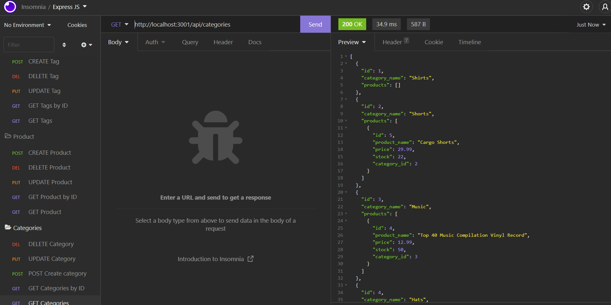
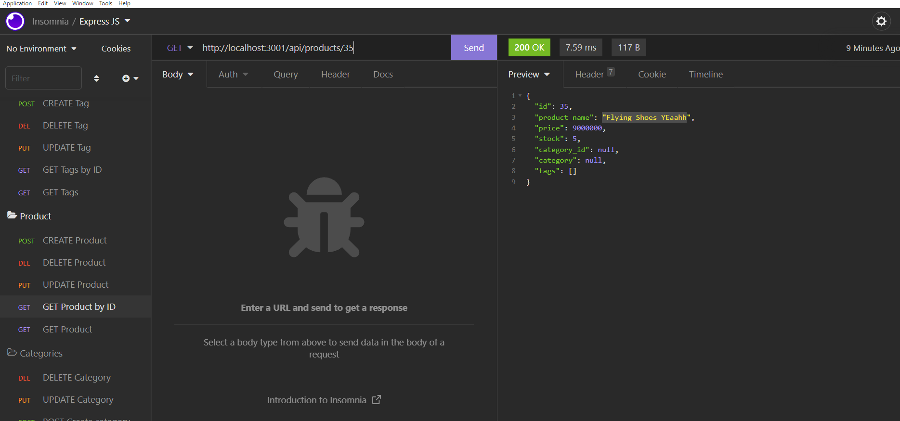
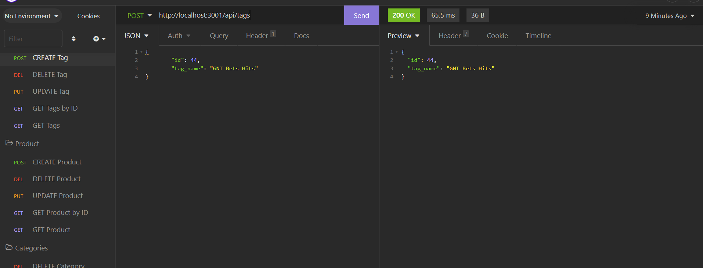

# E-Commerce_RV

## Description

- What was your motivation?  
  To build an application using Sequelize and MySQL Databases

- Why did you build this project?  
  To get a better understanding at how routing works and how to connect it with other packages

- What problem does it solve?  
  CRUD operations of a E commerce database

- What did you learn?  
  All of the CRUD methods and how they work
   
- Briefly describe your Project:  
  E Commerce Application where an user can create, read, update and delete from a database. You can use Insomnia to do this easier
   

## Table of Contents

- [Description](#description)
- [Installation](#installation)
- [Usage](#usage)
- [License](#license)
- [Contributors](#contributors)
- [Tests](#tests)
- [Questions](#questions)
- [Images](#images)

## Images

## Installation

What are the steps required to install your project?

    Once the repo is cloned, run an npm i, access the db folder, access mysql, source the schema, and run npm seed.

## Usage

Provide instructions for use:

    Once the above steps are donde, you can simply run "npm run start"

## Contributors

Enoc Rojas Villegas

## Tests

No testing

## Questions

Check out my work as well!
Find me on GitHub: 
 (https://github.com/Enrique-Rojas-Villegas)  
Email me: 📧 rojiyoyo@gmail.com
